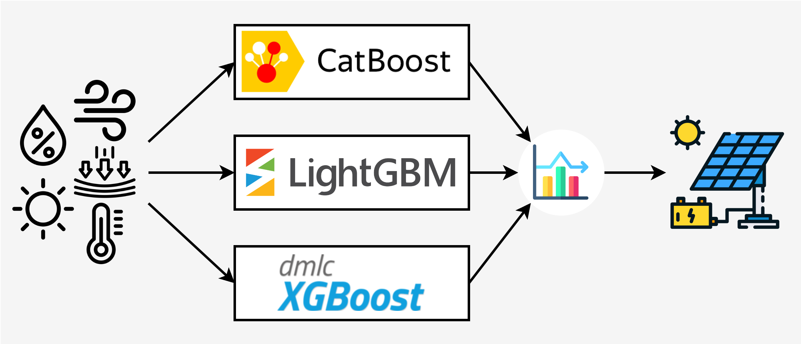
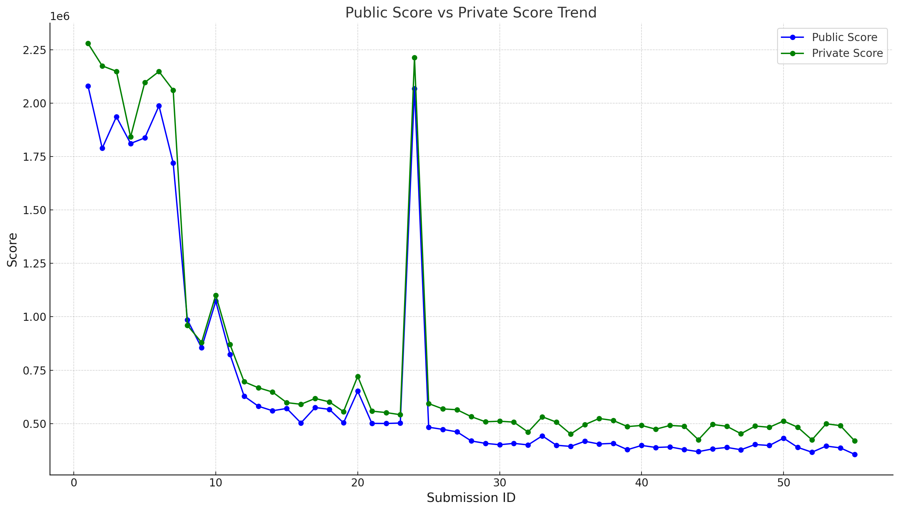

# PV-Power-Generation-Forecasting

## 🌞 Overview
This project focuses on predicting solar photovoltaic (PV) power generation based on regional microclimate data. The objective is to forecast the power output of PV devices installed in various terrains using environmental data such as temperature, humidity, wind speed, solar radiation, and rainfall.

## 💻 Installation
1. Clone the repository:
    ```sh
    git clone https://github.com/Shengwei-Peng/PV-Power-Generation-Forecasting.git
    ```
2. Navigate to the project directory:
    ```sh
    cd PV-Power-Generation-Forecasting
    ```
3. Install the required dependencies:
    ```sh
    pip install -r requirements.txt
    ```

## 📊 Dataset
### 1. [TrainingData](TrainingData) & [TrainingData_Additional](TrainingData_Additional)
- [AI CUP 2024](https://tbrain.trendmicro.com.tw/Competitions/Details/36)
    | **Column Name**      | **Description**               | **Unit** |
    | -------------------- | ---------------------------- | -------: |
    | `LocationCode`       | Location identifier          | -        |
    | `DateTime`           | Measurement timestamp        | -        |
    | `WindSpeed(m/s)`     | Wind speed                   | m/s      |
    | `Pressure(hpa)`      | Atmospheric pressure         | hPa      |
    | `Temperature(°C)`    | Temperature                  | °C       |
    | `Humidity(%)`        | Humidity percentage          | %        |
    | `Sunlight(Lux)`      | Sunlight intensity           | Lux      |
    | `Power(mW)`          | Power output                 | mW       |


### 2. [External Data](ExternalData)
- [IFENGL2](https://www.wunderground.com/dashboard/pws/IFENGL2), [IHUALIEN3](https://www.wunderground.com/dashboard/pws/IHUALIEN3)
    | **Column Name**      | **Description**              | **Unit** |
    | -------------------- | ---------------------------- | -------: |
    | `Temperature`        | Air temperature              | °C       |
    | `Dew Point`          | Dew point temperature        | °C       |
    | `Humidity`           | Air humidity                 | %        |
    | `Wind`               | Wind direction               | °        |
    | `Speed`              | Wind speed                   | km/h     |
    | `Gust`               | Peak wind speed              | km/h     |
    | `Pressure`           | Atmospheric pressure         | hPa      |
    | `Precip. Rate`       | Rainfall rate                | mm       |
    | `Precip. Accum.`     | Total rainfall               | mm       |
    | `UV`                 | UV radiation index           | -        |
    | `Solar`              | Solar radiation              | W/m²     |

- [466990](https://codis.cwa.gov.tw/StationData), [72T250](https://codis.cwa.gov.tw/StationData), [C0T870](https://codis.cwa.gov.tw/StationData), [C0T9E0](https://codis.cwa.gov.tw/StationData), [C0Z100](https://codis.cwa.gov.tw/StationData), [C0Z150](https://codis.cwa.gov.tw/StationData)
    | **Column Name**               | **Description**               | **Unit**  |
    | ----------------------------- | ----------------------------- | --------: |
    | `Station Pressure (hPa)`      | Station-level pressure        | hPa       |
    | `Sea Level Pressure (hPa)`    | Sea-level adjusted pressure   | hPa       |
    | `Temperature (°C)`            | Air temperature               | °C        |
    | `Dew Point (°C)`              | Dew point temperature         | °C        |
    | `Relative Humidity (%)`       | Air humidity                  | %         |
    | `Wind Speed (m/s)`            | Wind speed                    | m/s       |
    | `Wind Direction (°)`          | Wind direction                | °         |
    | `Max Wind Speed (m/s)`        | Maximum wind speed            | m/s       |
    | `Max Wind Direction (°)`      | Direction of max wind speed   | °         |
    | `Precipitation (mm)`          | Total precipitation           | mm        |
    | `Sunshine Duration (h)`       | Duration of sunshine          | h         |
    | `Solar Radiation (MJ/m²)`     | Solar radiation               | MJ/m²     |
    | `Ground Temp (0cm)`           | Ground temperature (0cm)      | °C        |
    | `Ground Temp (5cm)`           | Ground temperature (5cm)      | °C        |
    | `Ground Temp (10cm)`          | Ground temperature (10cm)     | °C        |
    | `Ground Temp (20cm)`          | Ground temperature (20cm)     | °C        |
    | `Ground Temp (50cm)`          | Ground temperature (50cm)     | °C        |
    | `Ground Temp (100cm)`         | Ground temperature (100cm)    | °C        |
## 🛠️ Usage

### Follow the steps in `main.ipynb`:

1. **Import and Setup**  
   Load libraries and functions for data handling and modeling.

2. Data Preprocessing (*Optional*)  
    If `train_x.csv`, `train_y.csv`, and `test_x.csv` are not available, preprocess the raw data to generate them.

3. **Data Loading**  
   Load preprocessed data and select feature columns.

4. **Model Training**  
   Train **CatBoost**, **LightGBM**, and **XGBoost**, make predictions, and save models and results.

5. **Ensemble**  
   Combine model predictions using an ensemble method and generate the final `submission.csv` for evaluation.

### 📂 Final Output Structure  
After completing the training and prediction, the following files will be generated:
```
AICUP/
├── training_data.csv  # Combined data from `TrainingData` and `TrainingData_Additional` folder
├── external_data.csv  # Combined external data from the `ExternalData` folder
├── train_x.csv        # Features used for training the models
├── train_y.csv        # Target variable used for training the models
├── test_x.csv         # Features used for making predictions
├── catboost_model.pkl # Trained CatBoost model
├── lightgbm_model.pkl # Trained LightGBM model
├── xgboost_model.pkl  # Trained XGBoost model
├── catboost_pred.csv  # Predictions from CatBoost model
├── lightgbm_pred.csv  # Predictions from LightGBM model
├── xgboost_pred.csv   # Predictions from XGBoost model
└── submission.csv     # The final submission file containing the ensemble predictions
```

## 📈 Results



<details>
    <summary>Show/Hide Results Table</summary>

| ID  | Upload Time         |  Public Score | Private Score |
| --- | ------------------- | -------------:| -------------:|
| 01  | 2024-11-18 05:00:40 |    2080700.95 |    2279572.22 |
| 02  | 2024-11-18 09:44:50 |    1789119.30 |    2174549.41 |
| 03  | 2024-11-18 09:57:53 |    1936269.36 |    2148889.63 |
| 04  | 2024-11-18 10:08:51 |    1811221.68 |    1842050.13 |
| 05  | 2024-11-18 10:32:02 |    1837177.48 |    2096727.91 |
| 06  | 2024-11-19 12:04:01 |    1987431.54 |    2148135.81 |
| 07  | 2024-11-19 03:32:53 |    1720059.50 |    2060600.83 |
| 08  | 2024-11-19 09:59:17 |     985780.43 |     960078.27 |
| 09  | 2024-11-19 10:14:01 |     854752.05 |     879881.16 |
| 10  | 2024-11-19 10:48:57 |    1072685.57 |    1101202.66 |
| 11  | 2024-11-20 12:54:06 |     824205.41 |     870917.05 |
| 12  | 2024-11-20 01:01:58 |     628281.62 |     695738.97 |
| 13  | 2024-11-20 05:09:11 |     581359.93 |     667819.00 |
| 14  | 2024-11-20 07:23:46 |     560151.59 |     647792.75 |
| 15  | 2024-11-20 07:43:33 |     570915.15 |     598089.80 |
| 16  | 2024-11-21 01:09:59 |     503108.75 |     590526.12 |
| 17  | 2024-11-21 01:34:51 |     575301.23 |     617709.15 |
| 18  | 2024-11-21 01:42:31 |     566783.82 |     601752.06 |
| 19  | 2024-11-21 02:03:29 |     503497.19 |     556083.36 |
| 20  | 2024-11-21 02:54:46 |     651794.75 |     721346.92 |
| 21  | 2024-11-22 12:10:06 |     500977.86 |     558400.65 |
| 22  | 2024-11-22 12:24:05 |     500588.64 |     551565.93 |
| 23  | 2024-11-22 01:55:31 |     502596.13 |     541711.74 |
| 24  | 2024-11-22 04:29:29 |    2067988.84 |    2212960.51 |
| 25  | 2024-11-22 05:21:02 |     483064.06 |     593766.05 |
| 26  | 2024-11-23 01:52:24 |     472851.80 |     568710.49 |
| 27  | 2024-11-23 02:22:18 |     461282.36 |     564863.34 |
| 28  | 2024-11-23 03:19:37 |     418670.68 |     532466.45 |
| 29  | 2024-11-23 11:41:31 |     407476.71 |     508553.97 |
| 30  | 2024-11-23 12:05:03 |     401027.85 |     511159.04 |
| 31  | 2024-11-24 12:05:48 |     407476.71 |     507011.25 |
| 32  | 2024-11-24 12:19:11 |     400222.27 |     460386.16 |
| 33  | 2024-11-24 02:35:06 |     442772.71 |     531965.98 |
| 34  | 2024-11-24 03:32:58 |     398627.30 |     506857.27 |
| 35  | 2024-11-24 08:29:17 |     393346.07 |     451063.93 |
| 36  | 2024-11-25 01:07:29 |     417173.37 |     495012.90 |
| 37  | 2024-11-25 01:52:03 |     404582.89 |     523922.83 |
| 38  | 2024-11-25 10:25:27 |     407552.42 |     514735.62 |
| 39  | 2024-11-25 12:58:02 |     377853.09 |     485979.75 |
| 40  | 2024-11-25 09:43:45 |     397801.42 |     491359.28 |
| 41  | 2024-11-26 01:27:38 |     388330.38 |     473736.73 |
| 42  | 2024-11-26 11:42:06 |     390831.75 |     491397.55 |
| 43  | 2024-11-26 02:03:14 |     378537.11 |     487647.68 |
| 44  | 2024-11-26 06:52:44 |     368758.14 |     424508.42 |
| 45  | 2024-11-26 07:51:48 |     381491.54 |     495907.34 |
| 46  | 2024-11-27 03:05:57 |     388500.90 |     487503.77 |
| 47  | 2024-11-27 03:37:11 |     377664.51 |     452648.44 |
| 48  | 2024-11-27 04:39:25 |     402065.87 |     488541.13 |
| 49  | 2024-11-27 05:05:18 |     397547.12 |     482793.11 |
| 50  | 2024-11-27 11:41:17 |     431869.78 |     512407.47 |
| 51  | 2024-11-28 02:02:39 |     388686.62 |     482839.81 |
| 52  | 2024-11-28 10:59:42 |     366082.67 |     423951.51 |
| 53  | 2024-11-28 06:20:57 |     394886.78 |     499104.56 |
| 54  | 2024-11-28 09:22:29 |     386407.25 |     490622.69 |
| 55  | 2024-11-28 11:57:48 | **356359.07** | **419747.93** |

</details>

## 🙏 Acknowledgements

We would like to express our sincere gratitude to the following organizations for their support and contributions to this project:

- **Competition Guidance Unit**: Information and Technology Education Department of the Ministry of Education.
- **Competition Planning Unit**: Artificial Intelligence Competition and Annotation Data Collection Project Office of the Ministry of Education.
- **Topic Provider**: Department of Information Engineering, National Dong Hwa University.
- **Platform Sponsor**: Trend Micro.

## 🤝 Contributing

We welcome contributions to the project! Please follow the guidelines below:

1. Fork the repository.
2. Create a new branch (`feature/your-feature-name`).
3. Commit your changes.
4. Submit a pull request.

## ⚖️ License

This project is licensed under the Apache License 2.0. See the [LICENSE](./LICENSE) file for more details.

## 📧 Contact

For any questions or inquiries, please contact m11207330@mail.ntust.edu.tw
